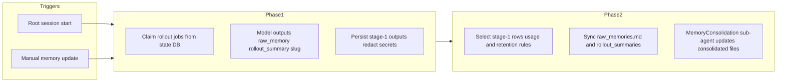

# How Codex memory works

This document summarizes behavior in **upstream Codex** (see [`README.md`](README.md) for the checkout path). Agenter does not ship this logic; treat this as operational reference when debugging large `~/.codex/memories` trees or noisy prompts on smaller models.

## Filesystem layout

Codex resolves a home directory `CODEX_HOME`:

- Default: `~/.codex`
- Override: environment variable **`CODEX_HOME`** — must exist and must be an ordinary directory (canonicalized).

Implementation: [`tmp/codex/codex-rs/utils/home-dir/src/lib.rs`](../../tmp/codex/codex-rs/utils/home-dir/src/lib.rs).

### Primary memory workspace: `$CODEX_HOME/memories`

Exposed as `memory_root(codex_home) => codex_home.join("memories")` in [`tmp/codex/codex-rs/core/src/memories/mod.rs`](../../tmp/codex/codex-rs/core/src/memories/mod.rs).

Typical consolidated layout (aligned with prompts and README):

| Path | Role |
|------|------|
| `memory_summary.md` | High-level navigational digest; eligible to be **injected** into developer instructions (truncated; see below). |
| `MEMORY.md` | Searchable handbook / registry; primary grep target in the **read-path** template. |
| `raw_memories.md` | Merged Phase 1 **raw_memory** payloads (bounded list, latest first) rebuilt before consolidation. |
| `rollout_summaries/*.md` | One file per retained rollout summary (synced from DB stage-1 outputs). |
| `skills/<name>/` | Optional reusable procedures (`SKILL.md`, plus optional `scripts/`, `examples/`, `templates/`). |

The **consolidation** prompt template (`consolidation.md`) also describes `raw_memories.md` as Phase 2 input and the same conceptual hierarchy (`memory_summary.md`, `MEMORY.md`, skills, rollout summaries). Templates live under [`tmp/codex/codex-rs/core/templates/memories/`](../../tmp/codex/codex-rs/core/templates/memories/).

### Extensions: `$CODEX_HOME/memories_extensions`

Stored **next to** `memories` (Codex swaps the last path segment from `memories` to `memories_extensions`). Optional layout:

- `<extension_name>/instructions.md` — how to interpret that extension’s signals.
- `<extension_name>/resources/` — extension-specific files; stale resources older than **`EXTENSION_RESOURCE_RETENTION_DAYS` (7)** can be deleted after consolidation (see [`tmp/codex/codex-rs/core/src/memories/extensions.rs`](../../tmp/codex/codex-rs/core/src/memories/extensions.rs)).

### Clearing on-disk artifacts

[`clear_memory_roots_contents`](../../tmp/codex/codex-rs/core/src/memories/control.rs) deletes **contents** of **`memories`** and **`memories_extensions`** under `codex_home` (refuses symlinked roots, then recreates directories). This does not by itself shrink the SQLite state DB; Phase 1 also **prunes** old stage-1 rows (`phase1::prune`).

## Pipeline overview

Codex splits work into **Phase 1** (per-rollout extraction into the DB) and **Phase 2** (global consolidation into files + consolidation agent).

Authoritative upstream narrative: [`tmp/codex/codex-rs/core/src/memories/README.md`](../../tmp/codex/codex-rs/core/src/memories/README.md).

### When the pipeline runs

[`start_memories_startup_task`](../../tmp/codex/codex-rs/core/src/memories/start.rs) returns early unless **all** hold:

- Session is **not** ephemeral.
- Feature **`MemoryTool`** is enabled (`config.features.enabled(Feature::MemoryTool)`).
- Session source is **not** a sub-agent session (e.g. not `SessionSource::SubAgent(_)`).
- **`state_db`** is available.

If those pass, a background task runs (in order): **`phase1::prune`**, **`phase1::run`**, **`phase2::run`**.

The same entrypoint is also invoked from the session handler **`update_memories`** ([`tmp/codex/codex-rs/core/src/session/handlers.rs`](../../tmp/codex/codex-rs/core/src/session/handlers.rs)) when the user triggers a memory update.

### Phase 1: rollout extraction

- Claims a **bounded** set of rollout jobs from the state DB (startup limits, age window, idle time, allowed interactive sources). Defaults and rules are documented in [`memories/README.md`](../../tmp/codex/codex-rs/core/src/memories/README.md).
- Runs extraction jobs with a fixed **concurrency cap** of **8** (`phase_one::CONCURRENCY_LIMIT` in [`mod.rs`](../../tmp/codex/codex-rs/core/src/memories/mod.rs)).
- Default extraction model label in code: **`gpt-5.4-mini`** (overridable via config `extract_model` on the effective `MemoriesConfig`).
- Model output is JSON with **`raw_memory`**, **`rollout_summary`**, **`rollout_slug`** (see `output_schema()` in [`phase1.rs`](../../tmp/codex/codex-rs/core/src/memories/phase1.rs)).
- Secrets are **redacted** before persistence.
- **Prune** (`phase1::prune`): deletes stale stage-1 DB rows older than **`max_unused_days`** in batches (`PRUNE_BATCH_SIZE` = 200).

### Phase 2: consolidation

- Claims a **global** Phase 2 job in the state DB; skips if not dirty or another run holds the lease.
- Selects stage-1 inputs using **`max_raw_memories_for_consolidation`** and **`max_unused_days`** (see README for ranking: usage count, last usage vs generated timestamps, watermark behavior).
- Rebuilds on-disk **`raw_memories.md`** and **`rollout_summaries/`** via [`storage.rs`](../../tmp/codex/codex-rs/core/src/memories/storage.rs): old summary files whose stems are no longer retained are deleted; if nothing is retained, `MEMORY.md`, `memory_summary.md`, and `skills/` may be removed.
- Spawns a **`SessionSource::SubAgent(SubAgentSource::MemoryConsolidation)`** agent with tightened config ([`phase2.rs` `agent::get_config`](../../tmp/codex/codex-rs/core/src/memories/phase2.rs)): working directory is the memories root; **`ephemeral`**; **`generate_memories` / `use_memories`** false for that thread; **`Feature::MemoryTool`** disabled so consolidation does **not** recurse into memory generation; approvals **`Never`**; **`WorkspaceWrite`** sandbox with **`network_access: false`** only on the memories root writable path.
- Default consolidation model in code: **`gpt-5.4`** with medium reasoning (`phase_two::MODEL` / `REASONING_EFFORT`), overridable via **`consolidation_model`**.

Prompt assembly: **`build_consolidation_prompt`** in [`prompts.rs`](../../tmp/codex/codex-rs/core/src/memories/prompts.rs), template **`consolidation.md`**.

## How a chat session consumes memory

### A. Developer-message injection (“read path”)

When assembling developer content for a turn, Codex may append memory instructions if:

- `Feature::MemoryTool` is on, and
- `config.memories.use_memories` is **true**, and
- `build_memory_tool_developer_instructions(&codex_home)` returns `Some`.

See [`tmp/codex/codex-rs/core/src/session/mod.rs`](../../tmp/codex/codex-rs/core/src/session/mod.rs).

That builder ([`prompts.rs`](../../tmp/codex/codex-rs/core/src/memories/prompts.rs)):

1. Reads **`$CODEX_HOME/memories/memory_summary.md`**.
2. Returns **`None`** (no injection) if the file cannot be read, is empty after **trim**, or is empty after the truncation step below.
3. **Truncates** the body to **`MEMORY_TOOL_DEVELOPER_INSTRUCTIONS_SUMMARY_TOKEN_LIMIT` = 5_000 tokens** (constant in [`mod.rs`](../../tmp/codex/codex-rs/core/src/memories/mod.rs)).
4. Renders **`read_path.md`**, embedding the truncated summary between `MEMORY_SUMMARY BEGINS/ENDS` markers.

The template [`read_path.md`](../../tmp/codex/codex-rs/core/templates/memories/read_path.md) instructs the model to **read only** (not update) memory files, prefer a **short** memory pass (on the order of **4–6** search steps), use `MEMORY.md` as the primary keyword index, open **`rollout_summaries/`** or **`skills/`** only when pointers justify it, and append a structured **`<oai-mem-citation>`** block when memory files were used.

**Note:** `read_path.md` describes rollout evidence under **`rollout_summaries/`** using JSONL-oriented language in places. The Phase 2 file sync layer in **`storage.rs` writes recap files as `*.md`** under `rollout_summaries/`; raw rollout traces referenced as `rollout_path` remain separate filesystem paths elsewhere.

**Implication for small models:** even before tool calls, every eligible turn can include **long read-path instructions plus up to ~5k tokens** of `memory_summary.md`. If `memory_summary.md` or `MEMORY.md` has grown very large, perceived “clutter” in the prompt is expected.

### B. Usage telemetry (feeds ranking and retention)

[`usage.rs`](../../tmp/codex/codex-rs/core/src/memories/usage.rs) increments counter **`codex.memories.usage`** when a **known-safe** shell / shell_command / exec_command invocation **reads or searches** paths that look like:

- `memories/MEMORY.md`
- `memories/memory_summary.md`
- `memories/raw_memories.md`
- `memories/rollout_summaries/…`
- `memories/skills/…`

Tags include which “kind” of memory file was touched and which tool name was used. That usage data feeds **Phase 2 input selection** (together with DB fields such as `last_usage` / `usage_count` as described in [`memories/README.md`](../../tmp/codex/codex-rs/core/src/memories/README.md)).

## Configuration (`memories` in config)

Types and defaults: [`tmp/codex/codex-rs/config/src/types.rs`](../../tmp/codex/codex-rs/config/src/types.rs) (`MemoriesToml`, `MemoriesConfig`). JSON schema: [`tmp/codex/codex-rs/core/config.schema.json`](../../tmp/codex/codex-rs/core/config.schema.json) (search for `MemoriesToml`).

Defaults (after `MemoriesConfig::default` and clamping in `From<MemoriesToml>`):

| Field | Default | Clamp / notes |
|-------|---------|----------------|
| `disable_on_external_context` | `false` | When `true`, external context sources can mark a thread’s `memory_mode` as `"polluted"`. |
| `generate_memories` | `true` | When `false`, new threads may be stored with `memory_mode = "disabled"` in the state DB. |
| `use_memories` | `true` | When `false`, **read-path developer instructions are not injected** (does not necessarily stop Phase 1/2 by itself — startup still keys off `MemoryTool` and other guards). |
| `max_raw_memories_for_consolidation` | `256` | `1…4096` — caps how many stage-1 rows are considered for Phase 2 and how many populate `raw_memories.md` / retained rollout summaries. |
| `max_unused_days` | `30` | `0…365` — stage-1 row retention for Phase 2 selection and Phase 1 DB prune. |
| `max_rollout_age_days` | `30` | `0…90` — rollout eligibility window. |
| `max_rollouts_per_startup` | `16` | `1…128` — rollout jobs per Phase 1 startup pass. |
| `min_rollout_idle_hours` | `6` | `1…48` — skip very fresh rollouts. |
| `extract_model` | `None` | Optional override string for Phase 1 extraction model. |
| `consolidation_model` | `None` | Optional override string for Phase 2 consolidation model. |

## Trace summarization (separate API)

[`memory_trace.rs`](../../tmp/codex/codex-rs/core/src/memory_trace.rs) exports **`build_memories_from_trace_files`**, which loads offline trace JSON/JSONL files, normalizes items, and calls **`ModelClient::summarize_memories`**. That path is distinct from the interactive **Phase 1 / Phase 2** pipeline that maintains `~/.codex/memories` from live rollouts.

## Reducing clutter and load

Operational levers consistent with upstream code:

- **Shrink consolidation breadth:** lower **`max_raw_memories_for_consolidation`** (still capped to at least `1`; upper bound **4096**).
- **Tighten staleness:** lower **`max_unused_days`** so Phase 2 ignores and Phase 1 prunes older stage-1 rows faster (within **`0…365`**).
- **Limit new ingestion:** **`generate_memories = false`** avoids marking new threads for memory generation in the DB (see field comment in `MemoriesToml`).
- **Stop injecting read-path prompts:** **`use_memories = false`** skips `build_memory_tool_developer_instructions` (helps small models immediately; consolidation may still refresh files depending on pipeline runs).
- **Disable the whole memory subsystem gate:** **`Feature::MemoryTool` off** — Phase 1/2 startup does **not** run (`start_memories_startup_task` early-return) and developer memory instructions are not added from that feature gate.
- **Nuclear reset on disk:** programmatic or CLI use of **`clear_memory_roots_contents`** (empty `memories` and `memories_extensions` directories under `CODEX_HOME`).

Always confirm behavior against the Codex revision you run; defaults and templates can change between releases.
